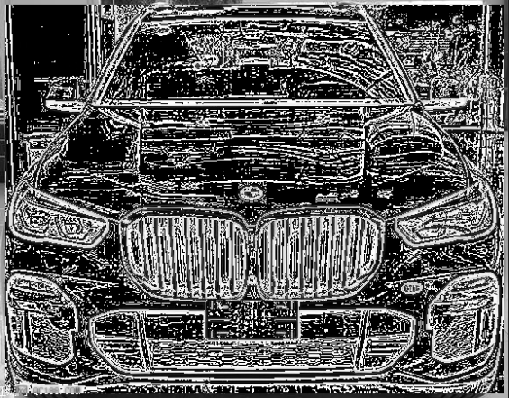
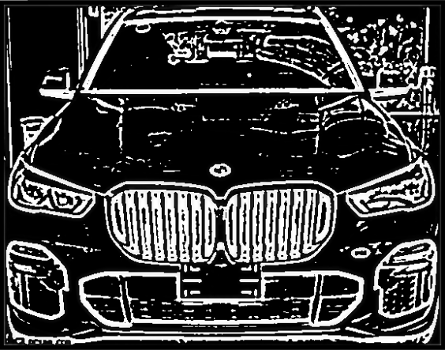
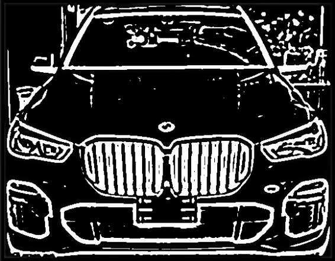

# Difference_of_Gaussians
 
input grayscale image, get 3 different level of DoG

original image:

DoG_1:

DoG_2:

DoG_3:

the result will be an array by [3 * y * x]

use **PIL.Image.fromarray(np.uint8(t1[0, :, :])).show()** to check